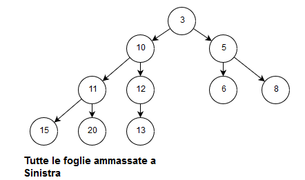
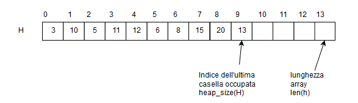
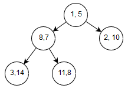
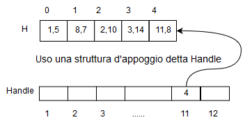
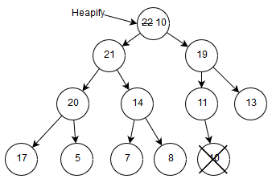

# Coda con priorità

$(e,p)$

La priorità serve per stabilire l'ordine di uscita dalla coda del valore.

```
Insert(Q, e, p)

Minimum(Q) --> e

Extract-min(Q) --> e

Decrease-key(Q, e, p)
```

## Lista

```
Insert - O(1)

Extract-min(Q) - O(n)

Decrease-key - O(n)
```

## Lista ordinata

```
Insert - O(n)

Extract-min(Q) - O(1)

Decrease-key - O(n)
```

> L'implementazione tramite lista risulta avere costi per l'implementazione delle primitive molto sbilanciate.

## Heap (binario)

Albero binario completo quasi perfettamente bilanciato a sinistra $\rightarrow$ PROPRIETA' STRUTTURALE

Ogni nodo: 1 key 



PROPRIETA' DI ORDINAMENTO: la chiave in v è $\leq$ delle chiavi nel sottoalbero

Memorizziamo le nostre chiavi in un array



```
Left(i) --> 2i+1

Riht(i) --> 2(i+1)

Parent(i) --> (i/2) - 1
```

per la proprietà delgi alberi binari completi.


### Primitive

```
Build_Heap(H): costruisce heap a partire dai valori in H

Min_Heap(H)-->k: restituisce chiave minima in H

Decrease_Key(H, i, k)--> H[i] := k

Heapify(H, i): ripristina proprietà H in caso di problemi d'ordinamento

Delete_Min--> k

Insert(H, k)
```
Alcune di queste primitive sono simili a quelle della coda con priorità.\
L'heap è alto $\Theta(logn)$

1. **Min_Heap(H)**
   
   ```
    Min_Heap(H)
        return H[0]
   ```

   Restituisce chiave nella radice

   Costo: $O(1)$

2. **Decrease_Key(H, i, k)**

    ```
    Decrease_Key(H, i, k)
        if k > H[i]
            then return "Chiave maggiore"
        H[i] := k
        while i >= 0 and H[padre(H, i] > k
            scambia(H[padre(H, i)], )
            i := (i / 2) - 1
    ```

   - Modificare H[i]
   - Confronto H[i] con la chiave del padre e scambio se necessario
   - Continuo fino a quando non sarà necessario fare lo scambio o sono arrivato alla radice

   Costo: $O(logn)$\
   guadagno rispetto alla implementazione con le liste.

3. **Insert(H, k)**

    ```
    Insert(H,k)
        DimHeap[H] := Dim[H] + 1
        H[DimHeap[H]] := k
        Decrease_Key(H, DimHeap[H], k)
    ```

   1. Inserisco un nuovo nodo come foglia subito a dx dell'ultima
   2. lavoro come Decrease_Key per piazzare la chiave nella posizione corretta

   Costo: $O(logn)$

4. **Heapify(H, i)**

    ```
    Heapify(H, i)
        num := i
        if FiglioSx(H, i) <= Dim[H] and H[FiglioSx(H, i)] < H[num]
            then num := FiglioSx(H, i)
        if FiglioDx(H, i) <= Dim[H] and H[FiglioSx(H, i)] < H[num]
            then num := FiglioDx(H, i)
                
        if num != i
            then
                tmp := H[i]
                H[i] := H[num]
                H[num] := tmp
                Heapify(H, num)
    ```
    1. Controllo se ho un figlio più piccolo
    2. se si: scambio con il minore dei miei figli

   *i è l'indice del nodo problematico*

   Ripristiniamo la proprietà di ordinamento di un Heap.

   Costo: $O(logn)$

5. **Delete_Min(H)**

    ```
    Delete_Min(H)
        min := H[0]
        H[0] := H[DimHeap(H)]
        DimHeap(H) := DimHeap(H) - 1
        Heapify(H, 0)
        return min
    ```

   Estraggo la radice e metto la foglia più a destra al posto della radice.\
   $\hookrightarrow$ ho creato un problema di ordinamento che posso risolvere con l'heapify.

   1. Sostituire chiave nella radice con quella dell'ultima foglia a destra.  
      La dimensione dell'heap cala di 1.
   2. Chiamo Heapify sulla radice 

   Costo: $O(logn)$

6. **Build_Heap(H)**

   ```
   Build_Heap(H)
      DimHeap[H] := lengHeap[H]
      for i := Padre(H, DimHeap[H]) down to 0
         Heapify(H, i)     
   ```

   Se ho i numeri memorizzati un un array posso costruire un heap ma potrebbe avere valori che non rispettano la proprietà di ordinamento.\
   Ricorramo ad un approccio **Bottom-up**:

   Chiamo Heapify sui sottoalberi a partire dal penultimo livello che non rispettano le proprietà di ordinamento fino a quando non arrivo alla radice.

   Costo: $O(nlogn)$ [chiamo heapify n volte]

   in realtà l'algoritmo risulta essere più efficace di così

   Costo: $O(n)$\
   *Questo perchè vengono effettuate tante chiamate su alberi bassi e poche su alberi alti*

Ritorniamo ora alla **Coda con priorità**, per rappresentarla possiamo infatti usare un Heap con coppie (e, p) come elementi con la chiave data dalla priorità.

$e \in \{1, ..., n\}$



Coda:  
Decrease_key(Q, 11, 6), nodo con valore 11 passa a priorità 6  

Heap:  
Decrease_Key(H, 4, 6), all'indice 4 la priorità diventa 6



## Heapsort

- **Input**: serquenza di numeri interi non ordinati.
- **Output**: sequenza ordinata in ordine crescente

$<11, 14, 22, 5, 8, 19, 13, 17, 20, 7, 21, 10>$

Costruisco Max_Heap

$<22, 21, 19, 20, 14, 11, 13, 17, 5, 7, 8, 10>$

**esempio primo passo:**\
L'heap che ne esce non rispetta le proprietà d'ordinamento quindi eseguo un Heapify sulla radice.




Heap rimasto: $<10, 21, 19, 20, 14, 11, 13, 17, 5, 7, \underbrace{8}_{\text{nuova heap size}}>$

Sequenza ordinata in fondo: $<22>$

L'heap size si riduce di uno e in fondo si trova l'elemento più grande nell'heap, andrò a ripetere questa procedura fino a quando nell'heap non rimarrà un solo valore.

Riesco a fare un ordinamento in-place: $O(nlogn)$.
